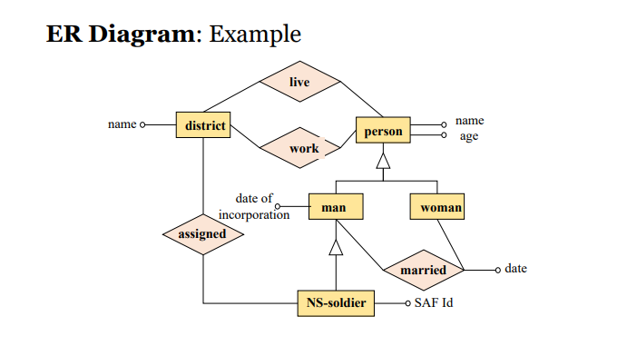

- DB Schema : structured blueprint of a database, defining tables, fields, data types, relationships, constraints

Users - use SQL -> in DBMS -> which affects DB

**ACID** :

Atomicity: Either all or none are executed (eg. Bank transaction)

Consistency: Ensure consistent data type , etc.

Isolation: Ensures that transactions happening at the same time do not affect each other(eg. 2 bank transcations at the same time on same account)

Durability: Guarantees that once a transaction is committed, its changes are permanent even in cases of power loss, crashes, or errors.

# Keys

Primary key : unique identifier for each record in a tabl
Foreign keys : creates a relationship by linking to the primary key of another table

# Normalized forms

1NF: Eliminate repeating groups, ensuring atomic values.
2NF: Eliminate partial dependencies on a composite primary key.
3NF: Eliminate transitive dependencies.

# ER (entity relation) diagram



# SQL

```sql

CREATE TABLE book(
title VARCHAR(256),
authors VARCHAR(256),
pages INT,
price FLOAT )

```

```sql
INSERT INTO book
VALUES ( “DBMS for Dummy”, “Bruce Benner”, 213, 79.90 )
```

```sql
SELECT title, price
FROM book
WHERE pages < 200
AND price < 50

SELECT title, pages
FROM book
ORDER BY pages DESC
```

```sql
UPDATE book
SET price = 29.90
WHERE title='Database for Dummy';
```

```sql
DELETE FROM book
WHERE title LIKE ‘%Data%’
```
