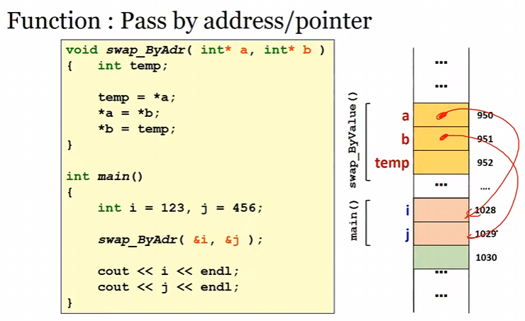
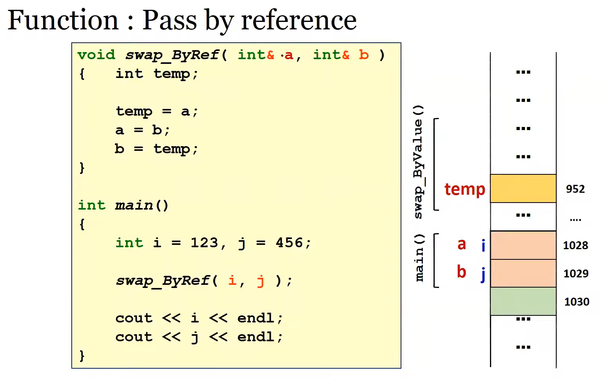

- volatile memory = RAM
- non-volatile memory = HDD,SSD
- dynamic RAM (RAM stick on motherboard)
- static RAM (in CPU, acts as cache , eg. L1,L2,L3 cache)
- when there's not enough RAM for an operation, the system uses part of the hard drive or SSD as virtual memory to extend the available memory

# Cache

- Principle of Locality

  - Temporal locality: If an item is referenced, likely to be referenced again
  - Spatial locality: If an item is referenced, likely to be referenced nearby items as well

- cache line : smallest unit of data that can be transferred between the cache and main memory (respect the Principle of Locality , often 32 to 128 bytes)

## Types of cache mapping

- Direct-Mapped: each memory block is mapped to exactly one cache block using a specific index derived from the block number (Cache index=Block number%Number of cache blocks)
- Fully Associative: any memory block can be loaded into any cache block , has Replacement policy : either FIFO (First-In-First-Out) OR LRU (Least Recently Used)
- Set-Associative: Balanced approach, reducing conflicts while managing complexity
