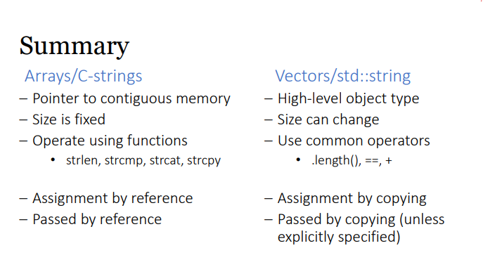

# Switch case

```cpp
switch (<cond>){
    case <c1> : statements
    case <c2> : statements
    default : statements
}
```

# std::string

basically better than C-String

```cpp
#include <string> // String is not a built-in primitive, requires directive
using namespace std;

string name;
// initialized with empty string ""

string name = "Mary";
string name2("xyz"); // can also use constructor
name = "Mary Poppins";
// can be assigned and reassigned

string one = "one";
string two = "two";
cout << (one < two) << endl;
// Compared using lexicographical ordering (compare letter by letter)

string first = "Mary";
string last = "Poppins";
string name = first + " " + last;
//Concat strings

char initial = first[0];
name[0] = 'L';
//access and modify string like array

cout << name.size();
cout << name.length();
// size or length

```

# When to use C-String or std::string?

- easier to use std::string
- cannot use printf (convert to C-String using `string.c_str()`)

C- String

```cpp
char s[20] = "This is a string";
char t[20];
strcpy(t, s);
int l = strlen(s);
if (strcmp(s, t) < 0) …
strcat(t, s);
```

std::string

```cpp
string s = "This is a string";
string t;
t = s;
int l = s.length();
if (s < t) …
t += s;
```

# Vector

basically better than arrays

- dynamic sizing
- store all same data type (like arrays)

```cpp
#include <vector>
#include <string>
using namespace std;

vector<string> strings;

vector<int> vect = {0, 1, 2, 3, 4, 5, 6, 7, 8, 9};

```

| **Operation**    | **Description**                                                  |
| ---------------- | ---------------------------------------------------------------- |
| `vector<T> v`    | Constructs a vector `v` to store elements of type `T`.           |
| `size()`         | Returns the number of elements in the vector.                    |
| `empty()`        | Returns `true` if the vector has no elements, `false` otherwise. |
| `clear()`        | Removes all elements from the vector.                            |
| `at(n)` or `[n]` | Returns a reference to the element at position `n`.              |
| `front()`        | Returns a reference to the first element.                        |
| `back()`         | Returns a reference to the last element.                         |
| `push_back(e)`   | Adds element `e` to the end of the vector.                       |
| `insert(pos, e)` | Inserts element `e` at the given position (iterator `pos`).      |
| `pop_back()`     | Removes the last element from the vector.                        |
| `erase(pos)`     | Erases the element at the given position (iterator `pos`).       |
| `begin()`        | Returns an iterator to the first element.                        |
| `end()`          | Returns an iterator to the element after the last element.       |

```cpp
// unlike arrays , vectors are pass by value by default , to use pass by reference , need to explicitly do it

void capitalize(string &input);
```

```cpp
//pass by reference to a constant

// Avoids copying large objects (which saves time and memory)
void capitalize(const string &input);
```


