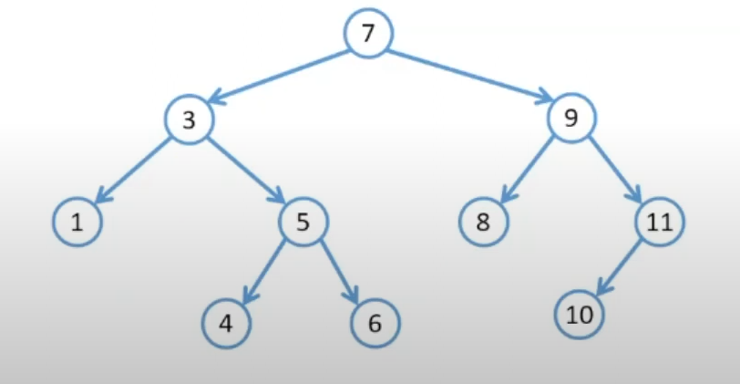
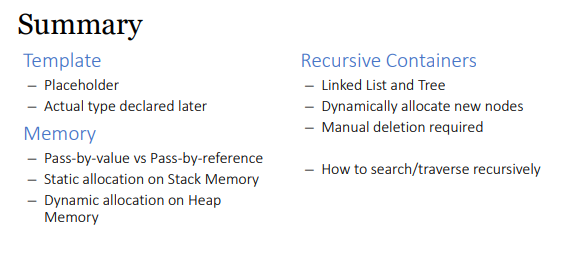

Cpp templates

```cpp
template <typename T>
T getMax(T a, T b) {
    return (a > b) ? a : b;
}

int main() {
    std::cout << "Max of 3 and 7: " << getMax(3, 7) << std::endl;
    std::cout << "Max of 5.5 and 2.3: " << getMax(5.5, 2.3) << std::endl;
    std::cout << "Max of 'A' and 'B': " << getMax('A', 'B') << std::endl;
    return 0;
}
```

Dynamic Memory allocation, on heap:

- To allocate , Use new

- To unallocate , Use delete

Linked list

Tree : DFS and BFS(not in TIC1002)

Binary search Tree

- each node at most 2 child
- left child < node value
- right child > node value
  
  
