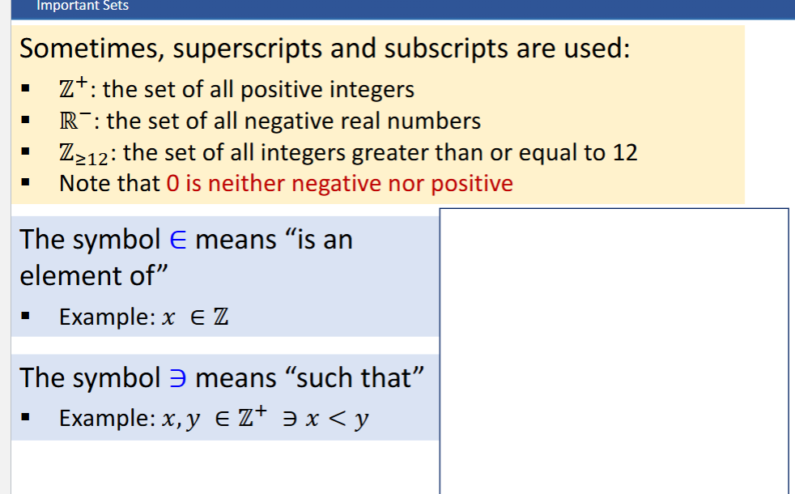

# Mathematical Sets of Numbers

| **Set**              | **Symbol** | **Description**                                                                        |
| -------------------- | ---------- | -------------------------------------------------------------------------------------- |
| **Natural Numbers**  | ℕ          | The set of all positive integers: {1, 2, 3, …}. Sometimes ℕ₀ includes 0: {0, 1, 2, …}. |
| **Integers**         | ℤ          | The set of all positive and negative whole numbers: {..., -2, -1, 0, 1, 2, ...}.       |
| **Rational Numbers** | ℚ          | Numbers that can be expressed as a ratio of two integers (fractions).                  |
| **Real Numbers**     | ℝ          | All rational and irrational numbers, covering the entire number line.                  |

## Superscripts / Subscripts

