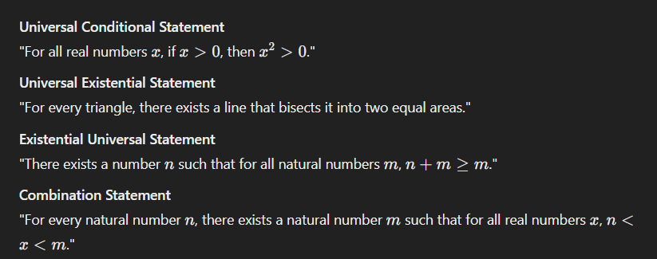

# Mathematical Sets of Numbers

| **Set**              | **Symbol** | **Description**                                                                        |
| -------------------- | ---------- | -------------------------------------------------------------------------------------- |
| **Natural Numbers**  | ℕ          | The set of all positive integers: {1, 2, 3, …}. Sometimes ℕ₀ includes 0: {0, 1, 2, …}. |
| **Integers**         | ℤ          | The set of all positive and negative whole numbers: {..., -2, -1, 0, 1, 2, ...}.       |
| **Rational Numbers** | ℚ          | Numbers that can be expressed as a ratio of two integers (fractions).                  |
| **Real Numbers**     | ℝ          | All rational and irrational numbers, covering the entire number line.                  |

# Superscripts / Subscripts

# Universal statement

> ∀ (for all)

- a certain property is true for ALL elements in the set

# Conditional statement

- 'if ... then'

# Existential statement

> ∃ (there exists)

- says that there is at least one thing for which the property is true

---

# Proof

> A proof is a concise, polished argument explaining the validity of a statement

# Terminology

- Definition
- Axiom/Postulate
- Theorem
- Lemma

# Basic Properties of Integers

- Closure
- Associativity
- Commutative
- Distributiveity
- Trichotomy
