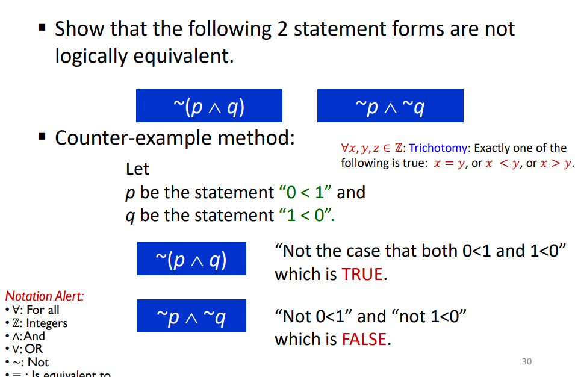
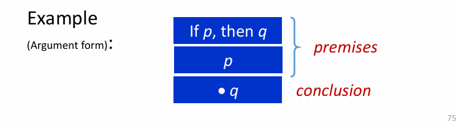
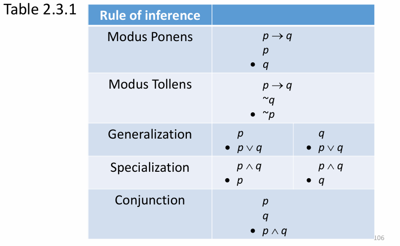
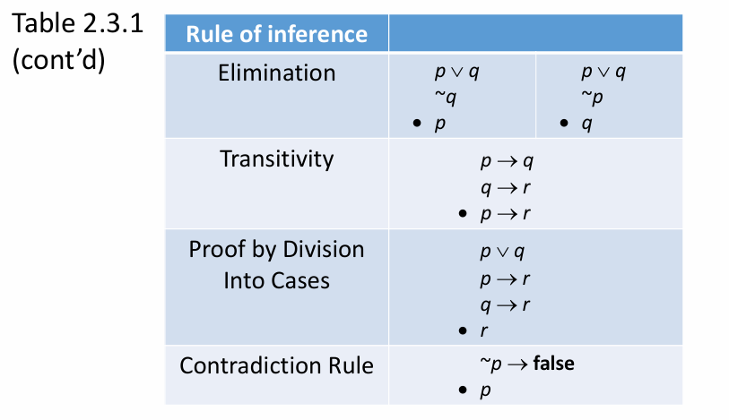
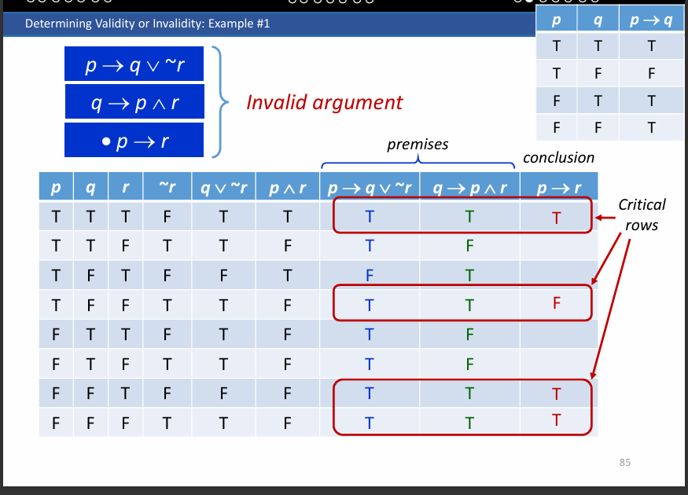

A statement is a sentence that is either true or false , but not both

# Statement Form

= statement variables + logical connectives(~,∧,V)

NOT = ~p

AND = p ∧ q

OR = p V q

XOR = (p ∨ q) ∧ ~(p ∧ q)

# Logical Equivalence

> P ≡ Q

# Counter Example

- De Morgan’s Laws
- A tautology (t) is a statement form that is always true
- A contradiction (c) is a statement form that is always false

# Summary of Logical Equivalences

1 to 11 ....

# Contrapositive, Converse, Inverse

- The contrapositive of p → q is ~q → ~p
- The converse of p → q is q → p
- The inverse of p → q is ~p → ~q

# Argument

Argument = a sequence of statements ending in a conclusion

Truth table to determine a argument

